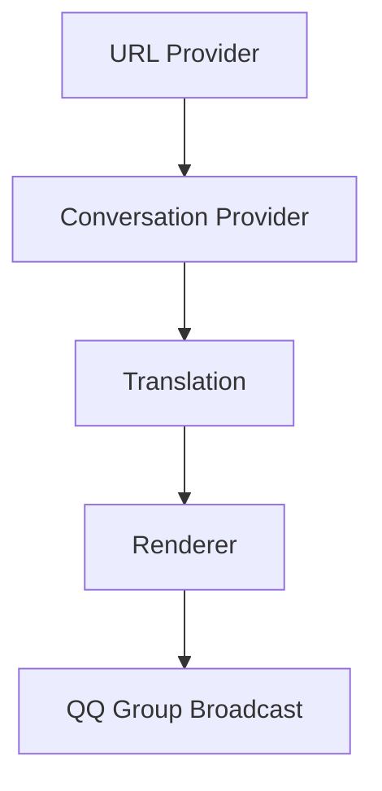
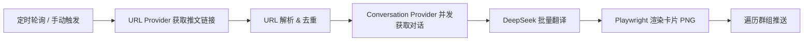
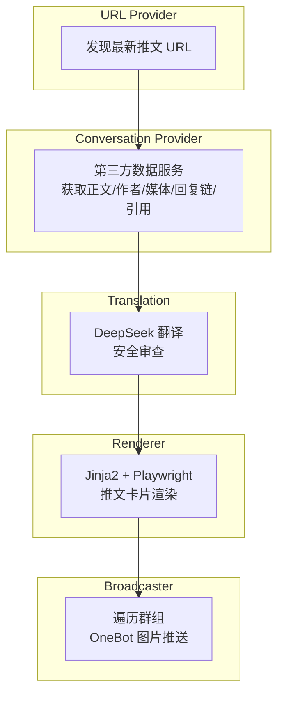

# nonebot-plugin-twitter-xfetcher

[](https://www.python.org/)
[](https://v2.nonebot.dev/)
[](./LICENSE)

NoneBot2 X/Twitter 推文获取与推送插件 — 获取用户配置账号的公开推文，通过第三方数据服务获取完整对话上下文，翻译为中文，渲染为推送卡片，广播到 QQ 群。

本项目采用模块化数据流水线设计：

```
URL Provider → Conversation Provider → Translation → Renderer → Broadcaster
```

LLM 不参与推文事实生成，仅用于 URL 发现及文本翻译处理。

## 功能架构



## Screenshot


## 项目特点

- [x] URL 发现与推文解析彻底解耦，URL Provider 可替换
- [x] 使用 Conversation API 获取完整回复链及引用
- [x] Playwright 渲染 X 风格深色推文卡片
- [x] DeepSeek 批量翻译，附带安全审查
- [x] NoneBot2 原生插件，支持 OneBot v11
- [x] 群级订阅/取消订阅，核心成员与可选成员分层管理
- [x] 水帖过滤、管理员权限、卡片自动清理
- [x] 指令名称、显示时区、轮询频率等均可配置

## 工作流程



## 系统架构



### 各模块职责

| 模块 | 路径 | 职责 |
|------|------|------|
| URL Provider | `clients/grok.py` | 通过 LLM 发现指定账号的最新公开推文 URL，只返回链接 |
| Conversation Provider | `clients/fxtwitter.py` | 调用第三方数据服务，解析对话数据为 `TweetConversation` 模型 |
| Translation | `clients/deepseek.py` | 批量翻译推文文本，含内容安全审查 |
| Renderer | `renderer/engine.py` | Jinja2 模板 + Playwright 截图，生成推文卡片 PNG |
| Broadcaster | `services/broadcaster.py` | 遍历群组，根据订阅/过滤规则推送卡片 |
| Scheduler | `scheduler.py` | APScheduler 定时轮询 + 卡片清理 |
| Storage | `storage/database.py` | JSON 文件读写，群配置、去重记录持久化 |
| Commands | `commands.py` | NoneBot Matcher 指令注册与处理 |

## 项目结构

```
nonebot_plugin_twitter_xfetcher/
├── __init__.py                 # 插件入口
├── config.py                   # 全部配置项
├── commands.py                 # 指令注册与处理
├── scheduler.py                # 定时任务
├── utils.py                    # 工具函数
├── pyproject.toml              # 项目元数据与依赖
├── clients/
│   ├── grok.py                 # URL Provider
│   ├── fxtwitter.py            # Conversation Provider
│   └── deepseek.py             # 翻译客户端
├── core/
│   └── tweet_pipeline.py       # 核心流水线
├── models/
│   ├── tweet.py                # TweetItem / TweetConversation 数据模型
│   └── group.py                # GroupConfig 数据模型
├── renderer/
│   ├── engine.py               # Playwright + Jinja2 渲染引擎
│   └── templates/
│       ├── base.html           # 基础样式
│       └── conversation.html   # 推文卡片模板
├── services/
│   ├── broadcaster.py          # 群组广播
│   └── subscription.py         # 订阅管理
├── storage/
│   └── database.py             # JSON 存储读写
└── data/                       # 运行时数据（gitignore）
    ├── group_subs.json
    ├── last_status.json
    └── config.json
```

## 快速开始

### 安装

```bash
pip install nonebot-plugin-twitter-xfetcher
```

> **注意**：首次使用必须安装 Chromium 浏览器内核，否则无法渲染推文卡片：
>
> ```bash
> playwright install chromium
> ```

### 配置

编辑插件目录下的 `config.py`，填入必要参数：

```python
# === 必填 ===
GROK_API_KEY = "Bearer xxx"          # Grok API 密钥（需兼容接口）
DEEPSEEK_API_KEY = "sk-xxx"          # DeepSeek API 密钥
CORE_MEMBERS = ["user_a", "user_b"]  # 核心账号（screen_name）
IMAGE_PROXY = "http://127.0.0.1:114514"#图片下载地址**如需显示图片必须配置** 

# === 推荐 ===
ADMIN_LIST = ["你的QQ号"]             # 管理员（可使用 update/reset）
DISPLAY_TZ = "Asia/Shanghai"         # 卡片时间戳显示时区
MAX_URLS_PER_MEMBER = 3              # 每个成员每次最多获取推文数
POLL_CRON_MINUTES = "2,32"           # 定时轮询分钟（每小时第 2、32 分）
```

全部配置项见 [配置参考](#配置参考)。

### 使用

在已接入 OneBot 的 QQ 群内：

```
/xfetch on                    # 开启本群推送
/xfetch subscribe @user_a     # 订阅可选成员
/xfetch update                # 管理员手动触发
```

## 指令

| 指令 | 权限 | 说明 |
|------|------|------|
| `/xfetch on \| off` | 所有人 | 开启/关闭本群推送 |
| `/xfetch subscribe @id` | 所有人 | 订阅可选成员 |
| `/xfetch unsubscribe @id` | 所有人 | 取消订阅 |
| `/xfetch waterfilter on \| off` | 所有人 | 水帖过滤（关闭时不推送 reply/quote） |
| `/xfetch update` | 管理员 | 手动触发获取与推送 |
| `/xfetch reset` | 管理员 | 清空去重记录 |

> 指令名可通过 `COMMAND_NAME` 配置项自定义。

## 配置参考

### API

| 配置项 | 类型 | 说明 |
|--------|------|------|
| `GROK_API_URL` | `str` | URL Provider API 地址（兼容接口），默认 `http://127.0.0.1:8000/v1/chat/completions` |
| `GROK_API_KEY` | `str` | URL Provider API 密钥，格式 `Bearer xxx` |
| `DEEPSEEK_API_URL` | `str` | DeepSeek API 地址 |
| `DEEPSEEK_API_KEY` | `str` | DeepSeek API 密钥，格式 `sk-xxx` |
| `FXTWITTER_API_BASE` | `str` | Conversation Provider API 地址，默认 `https://api.fxtwitter.com` |

### 账号

| 配置项 | 类型 | 说明 |
|--------|------|------|
| `CORE_MEMBERS` | `list[str]` | 核心账号，所有已开启的群默认推送 |
| `OPTIONAL_MEMBERS` | `list[str]` | 可选账号白名单，群可按需 subscribe |

### 时区

| 配置项 | 类型 | 说明 |
|--------|------|------|
| `JST` | `ZoneInfo` | 日本时区，内部时间解析用 |
| `CST` | `ZoneInfo` | 中国标准时间 |
| `DISPLAY_TZ` | `ZoneInfo` | 卡片时间戳显示时区，默认 `Asia/Shanghai` |

### 路径

| 配置项 | 类型 | 说明 |
|--------|------|------|
| `PLUGIN_DIR` | `Path` | 插件目录，自动推导 |
| `DATA_DIR` | `Path` | 数据目录，默认 `插件目录/data` |
| `CARD_DIR` | `Path` | 卡片图片缓存目录，默认 `插件目录/data/cards` |

### 运行参数

| 配置项 | 类型 | 默认值 | 说明 |
|--------|------|--------|------|
| `POLL_CRON_MINUTES` | `str` | `"2,32"` | 定时轮询 cron 分钟表达式 |
| `MAX_URLS_PER_MEMBER` | `int` | `3` | 每个成员每次最多获取推文数 |
| `MAX_POST_AGE` | `timedelta` | `6h` | 超过此时长的推文忽略 |
| `REQUEST_TIMEOUT` | `float` | `120.0` | API 请求超时秒数 |
| `HISTORY_LIMIT` | `int` | `10` | 每个成员去重记录保留条数 |
| `IMAGE_PROXY` | `str` | `"http://127.0.0.1:114514"` | 图片兼容代理地址 |

### 卡片

| 配置项 | 类型 | 默认值 | 说明 |
|--------|------|--------|------|
| `CARD_WIDTH` | `int` | `800` | 卡片宽度（像素） |
| `CARD_FONT_PATHS` | `list[str]` | 系统字体路径 | 渲染字体，需支持中日文 |
| `CARD_MAX_AGE_HOURS` | `int` | `24` | 卡片图片保留时长（小时） |
| `CARD_CLEANUP_CRON_HOUR` | `str` | `"4"` | 卡片清理 cron 小时 |
| `CARD_CLEANUP_CRON_MINUTE` | `str` | `"0"` | 卡片清理 cron 分钟 |

### 权限与指令

| 配置项 | 类型 | 默认值 | 说明 |
|--------|------|--------|------|
| `ADMIN_LIST` | `list[str]` | `[]` | 管理员 QQ 号列表 |
| `COMMAND_NAME` | `str` | `"xfetch"` | 指令前缀，修改后所有指令自动适配 |
| `HELP_MESSAGE` | `str` | 自动生成 | 帮助文本 |

## 数据存储

运行时数据以 JSON 格式存储在 `data/` 目录：

| 文件 | 内容 |
|------|------|
| `group_subs.json` | 各群订阅/取消订阅/水帖过滤状态 |
| `last_status.json` | 推文去重记录 |
| `config.json` | 群主开关状态 |

## Disclaimer

- 本项目仅用于学习、研究及个人自动化用途。
- 本项目仅处理用户通过配置指定的账号公开发布的推文，不会主动获取非公开内容。
- 本项目不是 X（Twitter）官方产品，与 X Corp 无任何关联。
- 本项目依赖第三方数据服务（URL Provider、Conversation Provider），不保证其长期可用性。
- 用户应自行遵守相关平台服务条款及所在地法律法规。
- 推文文本、图片、视频及其他媒体版权归原作者所有。本项目仅对公开数据进行展示、翻译与格式化。
- 用户自行承担使用第三方 API 产生的费用及风险。

## 鸣谢

- **[chenyme/grok2api](https://github.com/chenyme/grok2api)** — 提供 Grok 兼容接口，用作 URL Provider。版权归原项目所有。
- **[FxEmbed/FxEmbed](https://github.com/FxEmbed/FxEmbed)** — 提供推文媒体数据服务，用作 Conversation Provider。版权归原项目所有。

本项目与上述第三方项目无合作或背书关系。

## License

[MIT](./LICENSE)